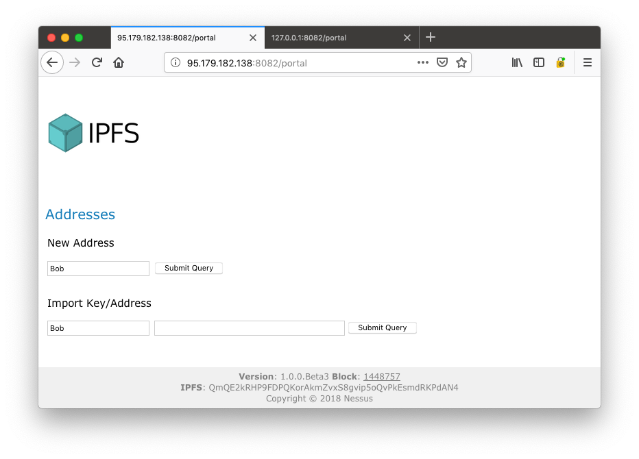
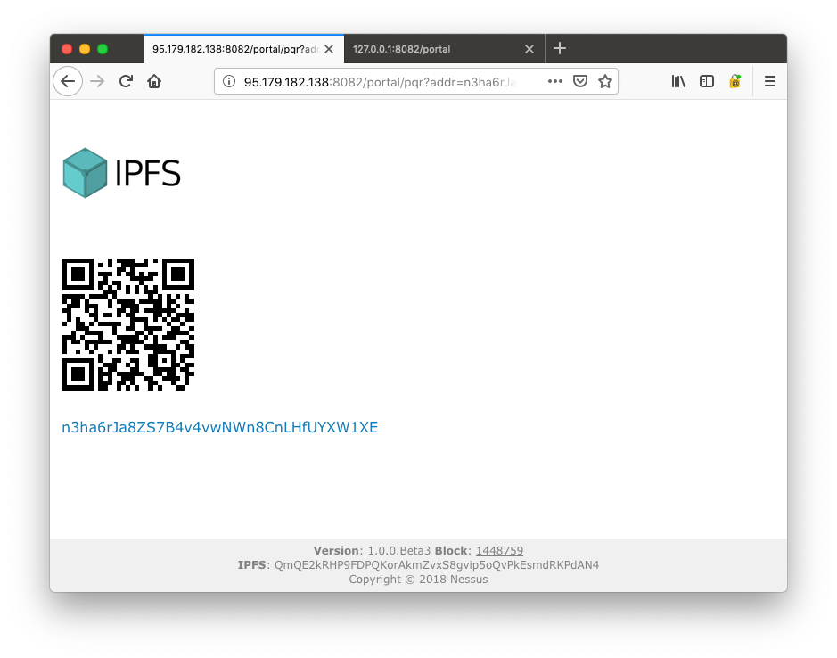
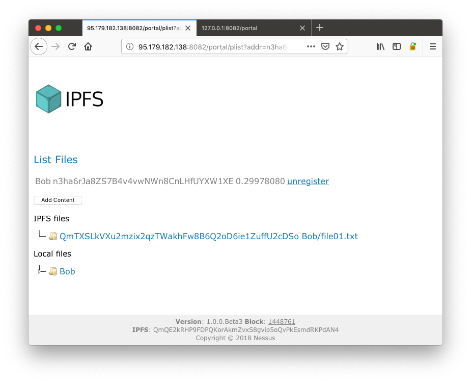
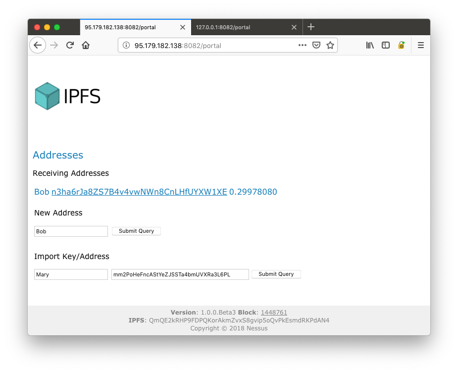
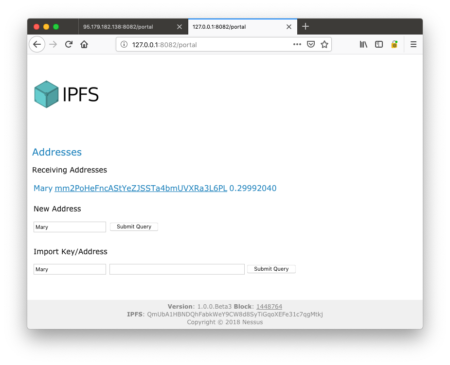

## Blockchain + IPFS Demo

Welcome, I'm glad you made it to this page.

In this demo we connect to two low cost [VPS](https://www.vultr.com). Each hosting a [Docker](https://www.docker.com/community-edition) environment with these service.

* IPFS
* Bitcoin Testnet
* Nessus JAXRS 
* Nessus WebUI 

Networking between these containers is isolated by Docker. The demo records OP_RETURN data on the Bitcoin network to provide proof of ownership and encryption capabilies of content stored on IPFS. 

Without further ado, lets dive right into what we have here ...

### Bob visits Nessus

Our first actor is Bob. He has heard about what [Nessus](https://github.com/jboss-fuse/nessus) is doing with IPFS and would like to give Mary, who we will meet later, an encrypted copy of his medical records. For ensurance reasons, he needs proof that Mary has been given access to these records by a certain date. Needless to say, he does not want anybody else, but Mary, to be able to access these records.

Bob visits Nessus here: [http://95.179.182.138:8082/portal](http://95.179.182.138:8082/portal)

In the footer you see some information about this version, the current block in the blockchain and the IPFS peer identity.

#### New Address

Here we can create a new address for Bob.

#### Receiving Addresses

Is the list of addresses that Bob's wallet knows about. Initially, we see the single default address that we just created. 
This address has no funds yet.

Bob's balance should show up on the explorer like [this](https://live.blockcypher.com/btc-testnet/address/n3ha6rJa8ZS7B4v4vwNWn8CnLHfUYXW1XE)

#### Import Key

Here we can also import existing addresses from people we want to send files to.

### Give Bob some coin

When the demo records stuff on the blockchain it will have to pay network fees and a small amount for every data record.
Giving Bob some coin from a [testnet faucet](http://bitcoinfaucet.uo1.net/send.php) is plenty for this demo.

### Register Bob's public key

All file content stored on IPFS is encrypted with a key derived from the owner's private key. This encryption key is now registered on the blockchain so that others can find it. 

We register the Nessus public encryption key by clicking on __register__.

We can head over to the block exporer and look at Tx: [66c636d9e00d31a5dadbe7aec8dd4f8dcaf0b4245b3681795a16f4a9c2a0d9b8](https://live.blockcypher.com/btc-testnet/tx/66c636d9e00d31a5dadbe7aec8dd4f8dcaf0b4245b3681795a16f4a9c2a0d9b8/)

### Bob adds his medical records

By clicking on one of Bob's addresses, we come to a page that lists local and IPFS file content. At this stage, the list is empty. 
Please note, that this does actually not query the IPFS network. Instead it queries the blockchain for references to IPFS files associated with this address.

We procede in the obvious way ...

#### Add by Content

Allows us to add some content directly from this page, which we will do by clicking the first __Submit__ button.

#### Add by URL

Allows us to add some content from an URL.

### Bob inspects his IPFS content

We are back on the page that lists Bob's IPFS content and voila, we see the IPFS hash that has just been associated with Bob's address.

We can now right click on the IPFS content ID to __show__ the encrypted content as it is known to IPFS.

	Nessus-Version: 1.0
	Path: Bob/file01.txt
	Owner: n3ha6rJa8ZS7B4v4vwNWn8CnLHfUYXW1XE
	Token: ZQDXCcSwmWWX...Ejr4v1A==
	NESSUS_HEADER_END
	AAAADIJbhvZ7VBqW1Nk6qAu/WhaRkCPzx5pqdUCSOb7cLjF0s/LNZhDnXCuEwGTH7dzstk2bn8BTGX7bK2hkXnZv

A right click on the local content can __show__ us the plain file content stored in our workspace.

All plain content is mapped to host's file system like this. 
This is also where you can move your stuff too so that it can later be encrypted and uploaded to IPFS.

	$ cat ~/.nessus/plain/n3ha6rJa8ZS7B4v4vwNWn8CnLHfUYXW1XE/Bob/userfile.txt 
	The quick brown fox jumps over the lazy dog.
	
### Bob decrypts his medical record

On the IPFS file list, we can also __get__ encrypted content from IPFS and save a decrypted copy locally

On __get__ the content owner can remap the content to a differnt path. Nessus does (by default) not allow to overwrite already existing paths. 
No problem, local content can also easily be __removed__ before the IPFS __get__. 

### Bob imports Mary's address

Bob imports Mary's address like this

Because Bob does not own Mary's private key, this is a "watch only" address. It allows Bob's wallet to see Mary's transactions - specifically her public encryption key.
Import is a potentially not-so-swift ansynchronous operation on the blockchain wallet. This is because the wallet needs to scan the blockchain to find unspent transaction outputs
(UTXO) that belong to the imported address. Eventually, Mary's address will show up like this ...

### Mary visits Nessus

Mary also has access to Nessus. Like Bob, she registers her public key.
Please note, that if Bob is not using a full blockchain node which would allow reindexing, this must happen after Bob has imported Mary's address.

While Bob has setup his instance on a VPS. Mary has done so on her MacBook. 
She can visit Nessus here: [http://127.0.0.1:8082/portal](http://127.0.0.1:8082/portal)

### Bob sends his medical record to Mary

Bob can now head over to his file list and click on __send__. This works for single files and entire directories of IPFS content.

On the next screen bob can select Mary as the target destination. Specifically, Bob's can select any address for which his wallet has found UTXO 
for an address registration. Unregistering an address spends that output and all wallets that have imported that address will no longer have that 
destination available.

### Mary gets Bob's medical record

After a while Mary's wallet sees the tranasaction on the Nessus network and Mary's IPFS node will be able to see the IPFS file.

### Mary decrypts Bob's medical record

Mary (and only Mary) can now get/decrypt that IPFS file.

### Mary takes a look at the content

The previous __get__ has first transferred the encrypted file to Mary's local storage and then decrypted it.
Marr can now click __show__ on the decrypted file to view the content.

### Finally

Thanks for watching this demo, perhaps you liked it.

